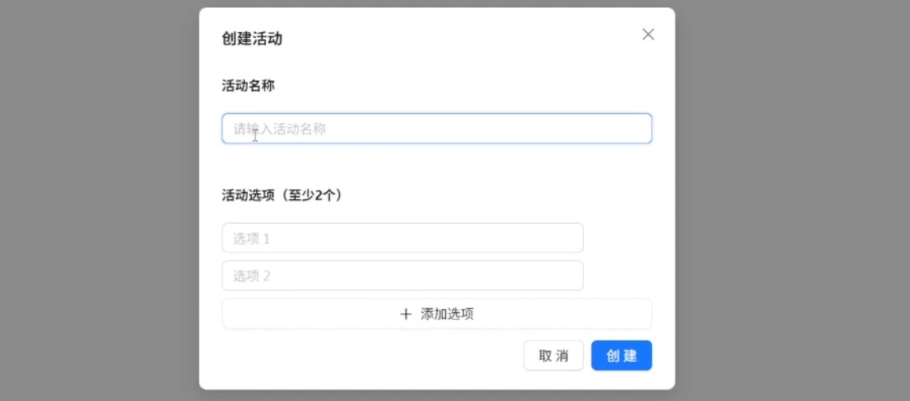
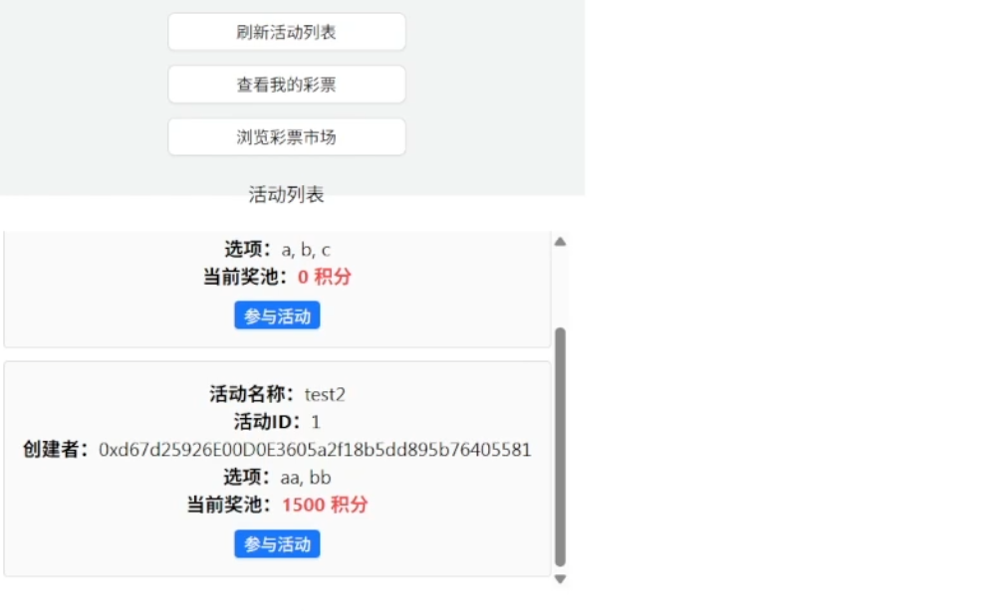
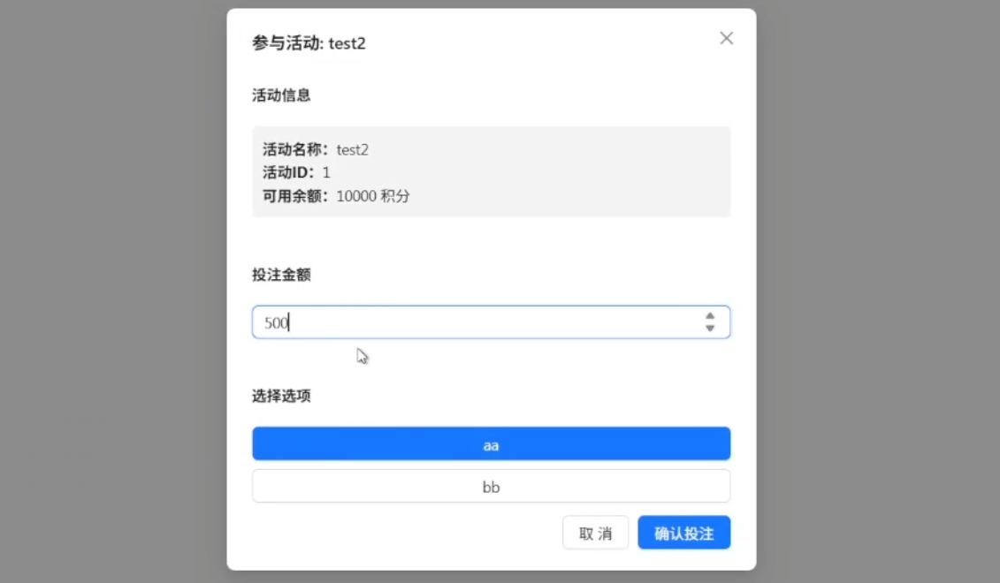
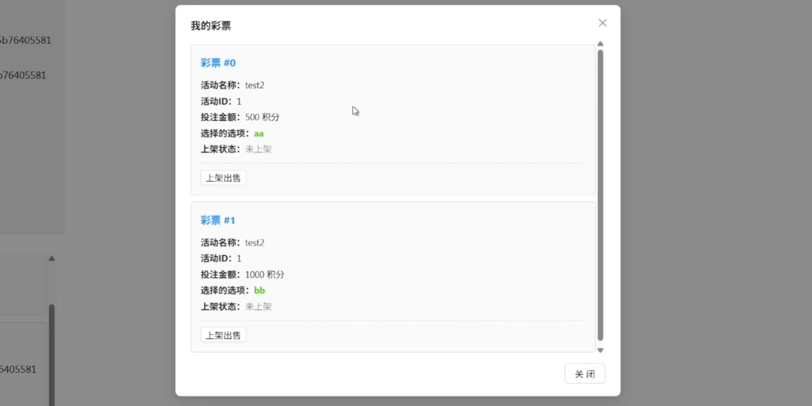
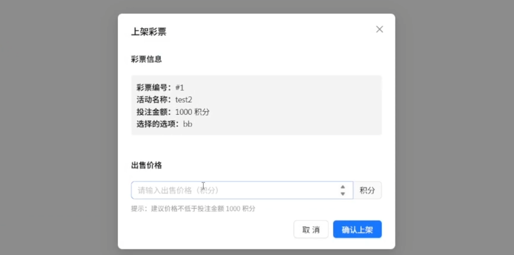
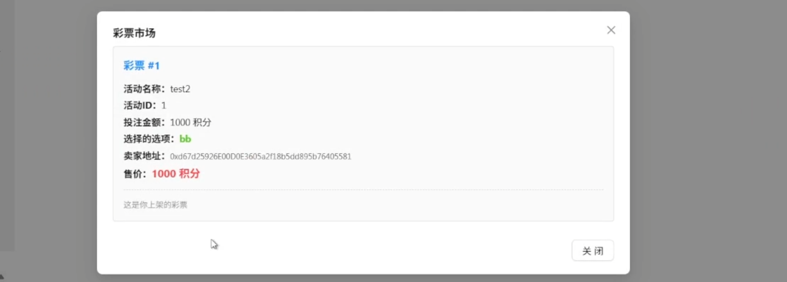
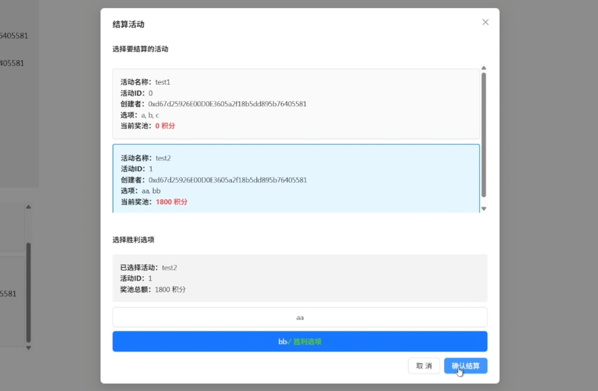

# ZJU-blockchain-course-2025

进阶的去中心化彩票系统，参与方包括：竞猜玩家、公证人

## 如何运行

补充如何完整运行你的应用。

1. 在本地启动ganache应用。

2. 在 `./contracts` 中安装需要的依赖，运行如下的命令：
    ```bash
    npm install
    ```

3. 在 `./contracts` 中编译合约，运行如下的命令：
    ```bash
    npx hardhat compile
    ```

4. 将合约部署到区块链上，运行如下的命令：

    ```
    npx hardhat run .\scripts\deploy.ts --network ganache
    ```

5. 将部署到区块链上的命令执行后弹出的合约地址复制到`./frontend/src/utils/contract-addresses.json`对应的值中

6. 将编译后得到的abis文件(位于`./contracts/artifacts/contracts/`下的三个文件夹中相应的`EasyBet.json`,`Points.json`,`Ticket.json`)复制到`./frontend/src/utils/abis/`中

7. 在 `./frontend` 中安装需要的依赖，运行如下的命令：
    ```bash
    npm install
    ```

8. 在 `./frontend` 中启动前端程序，运行如下的命令：
    ```bash
    npm run start
    ```

## 功能实现分析

- #### 发行了一个ERC20合约作为积分完成彩票全流程。

  通过创建新的，继承自ERC20的合约，作为后续交易的积分使用。

- #### 管理员可以创建拥有两到多个选项的活动，并发布。

  通过完善`struct Activity`将奖池，选择，名称，字符串数组形式的选项等存放在结构中，并建立活动id到活动结构的映射，以实现同时存在多个活动。

  ```solidity
  struct Activity {
          address owner;
          uint256 listedTimestamp;
          string[] choices;
  
          string name; //活动名称
          uint256 totalAmount; // 奖池总金额
      }
  ```

  

- #### 管理员还可以选择任意活动并输入竞猜结果，进行结算。胜利玩家平分奖池金额。

  通过在合约中创建一个仅管理员可调度的结算函数`function settle(uint256 activityId, string memory choice_win) public onlyManager()`，输入活动id和胜利选项来进行结算。首先根据活动id找到活动对应的信息，如总金额等。随后扫描所有彩票，根据是否是对应活动，对应的选项来统计赢家。然后根据赢家数量和奖池，发放对应数量的积分给每个赢家。最后移除活动。

- #### 玩家可以领取初始的一定额度积分，用作交易。

  根据demo中的空投函数，在ERC20合约中存在一个`address => bool`的映射，记录地址对应用户是否领取过空投，随后生成固定数量的积分发放给对应用户。

- #### 玩家可以浏览所有进行中的活动，并选择活动某个选项，输入一定额度来买入，玩家会获得对应的彩票凭证作为证明。

  前端获取到所有进行中活动的信息并展示给用户，用户买入后在合约中将积分交易到合约地址，合约生成存储活动信息，拥有者和下注选项的彩票，并将下注金额加入到活动对应的奖池中。

  ```solidity
  contract Ticket is ERC721 {
      ...
      // 生成彩票
      function mint(address to, uint256 activityId, uint256 amount, string memory choice) external{
          uint256 tokenId = nextTokenId++; // 创建彩票id
          _mint(to, tokenId); // 生成
          ticketInfos[tokenId] = TicketInfo(activityId, amount, choice); // 彩票池中添加彩票，便于后续扫描
      }
      ...
  }
  ```

  

- #### 玩家可以浏览自己拥有的所有彩票，并选择任意彩票，以任意价格挂单出售。

  前端获取到所有彩票信息，将拥有者为玩家的彩票展示。挂单彩票时，首先将彩票**转移到合约**进行管理，推入合约维护的上架彩票池（额外保存卖家地址方便交易），便于其他玩家浏览和交易。

  ```solidity
      // 上架彩票
      function listTicket(uint256 tokenId, uint256 price) public {
          require(msg.sender == ticket.ownerOf(tokenId), "Not the ticket owner");
  
          // 将彩票转移到合约进行托管
          ticket.transferFrom(msg.sender, address(this), tokenId);
  
          ticketPool[tokenId] = TicketOnSale({
              tokenId: tokenId,
              price: price,
              seller: msg.sender
          });
          ticketsOnSale.push(tokenId);
      }
  ```

  

- #### 玩家可以浏览所有挂单出售的彩票，并选择进行买入。

  前端可以获取到所有挂单出售彩票信息，展示给玩家。玩家选择对应彩票并进行交易时合约会检查买家是否有足够积分，之后支付积分给卖家，合约将彩票转给买家，并将彩票从上架彩票池中移除即可完成交易。

  

## 项目运行截图

主界面：


管理员创建活动界面：



浏览进行中的活动的界面，可以查看活动的名称，选择，创建者和奖池等



参与活动的界面，包括输入投注额度，选择下注选项等等



浏览我的彩票界面，包括彩票对应的活动，投注的额度和选择等



上架彩票的界面，填写出售价格即可出售



浏览彩票市场的界面，可以看到彩票的具体信息和售价，对于自己上架的彩票无法购买



非管理员界面，没有创建活动和结束活动的相关操作


管理员结算活动的界面，选择活动和胜利选项进行结算，积分发放等操作




## 参考内容

- 课程的参考Demo见：[DEMOs](https://github.com/LBruyne/blockchain-course-demos)。
- 快速实现 ERC721 和 ERC20：[模版](https://wizard.openzeppelin.com/#erc20)。记得安装相关依赖 ``"@openzeppelin/contracts": "^5.0.0"``。

